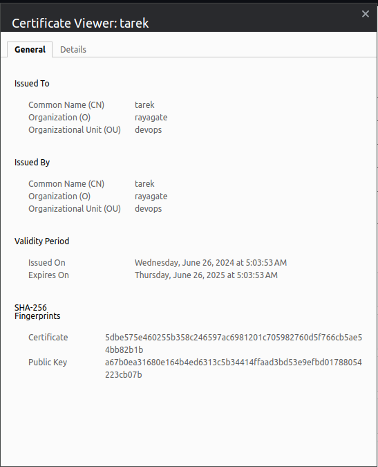

# Challenge Setup


## Running the Application

1. Clone the repository:

    ```sh
    git clone <repository-url>
    cd <repository-directory>
    ```


2. Start the application using Docker Compose:

    ```sh
    docker compose up --build
    ```
3. Install Laravel dependencies
    ```sh
    docker compose exec api php artisan cache:clear
    docker compose exec api php artisan config:clear
    docker compose exec api composer update
    docker compose exec api php artisan key:generate
    ```
4.  Run the database migrations:
    ```sh
    docker compose exec api php artisan migrate:fresh --seed
    ```
5. Access the application:

    - Client: [https://localhost](https://localhost)
    - API: [https://localhost/api](https://localhost/api)

## Screenshots

1. docker-compose running screenshot


2. client screenshot


3.  API screenshot (changed port from 80 to 443 and ran through https)


4. ssl  screenshot




[](https://github.com/Tareqmohamed/challenge-devops/actions/workflows/main.yml)
